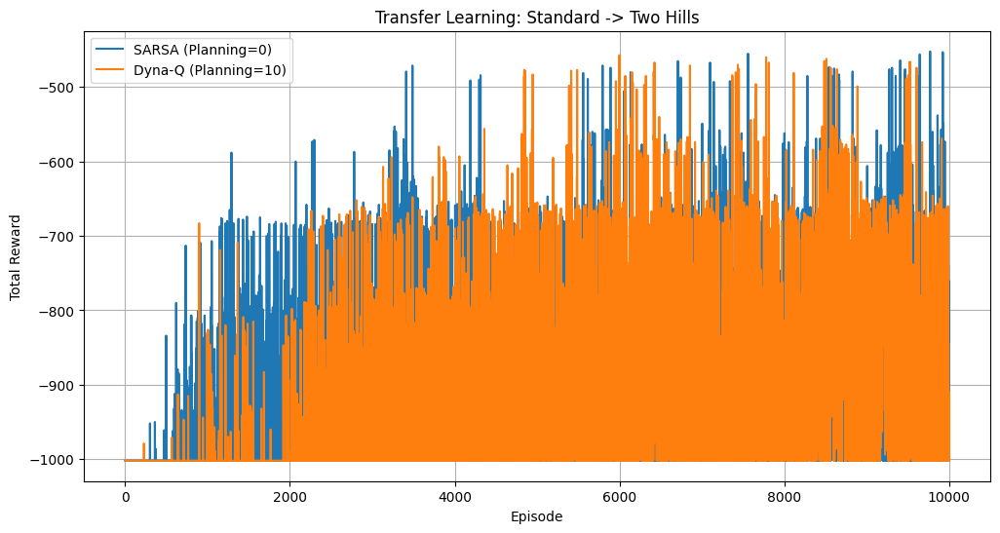
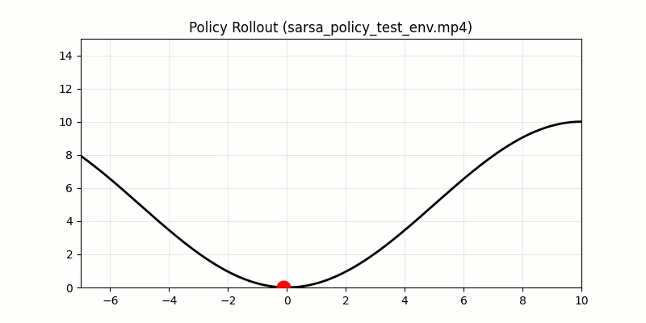
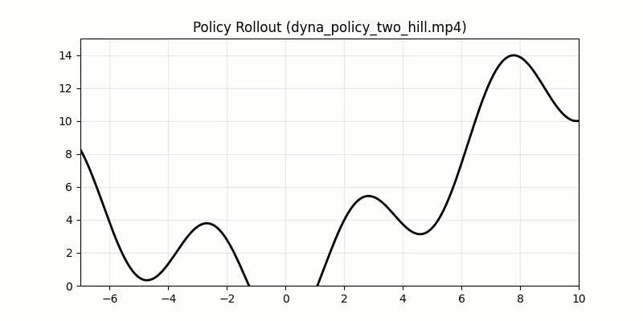

# Adaptive Dynamics: Dyna-Style RL on Custom Mountain Car

The core challenge addresses **Model-Based Reinforcement Learning** where the internal model is imperfect. The agent learns a **perturbation force model ($F_{pert}$)** to correct its internal simulator (standard physics) to match the real-world dynamics (complex terrain), accelerating the learning process through planning.

## Environment: Modified Mountain Car

The environment is a variation of the classic Gymnasium Mountain Car with two distinct modes:

1.  **Standard Mode (Simulator):** A standard convex valley. Used for pre-training and as the base physics model.
2.  **Extended Mode (Real World):** A complex terrain with **two hills**. This represents the "Real Environment" where the agent must adapt its policy.

### Physics & Terrain
The terrain is defined by a sine-wave based height map with an optional second term for the extended mode:
$$h(x) = 5 \sin \left( \frac{\pi x}{10} - \frac{\pi}{2} \right) + 5 + c \left( \sin \left( \frac{4 \pi x}{10} - \frac{\pi}{2} \right) + \frac{x}{10} \right) u(x)$$

The dynamics learner captures the difference between the two environments using:
$$F_{\text{pert}}(x) = m \frac{dv}{dt}_{\text{real}} - (F - mg \sin \theta_{\text{known}})$$

## Algorithms Implemented

1.  **n-step SARSA:** Used for direct interaction with the real environment to update Q-values based on actual experience.
2.  **Dyna-Q Planning:** Used to simulate experience. The agent samples previously visited states, predicts the next state using the learned perturbation model, and performs additional Q-updates.
3.  **Transfer Learning:** 
    *   **Phase 1:** Train optimal policy on Standard Curve.
    *   **Phase 2:** Initialize Two-Hills agent with Standard weights.
    *   **Phase 3:** Apply Dyna-Q to adapt to the new terrain topology.

## Hyperparameters

*   **Learning Rate ($\alpha$):** 0.5
*   **Discount Factor ($\gamma$):** 0.99
*   **n-step:** 5
*   **Planning Steps:** 10 (Dyna-Q) vs 0 (Baseline SARSA)
*   **Episodes:** 2000 (Transfer Phase)

## Results

### 1. Training Performance: SARSA vs. Dyna-Q
The plot below compares the convergence speed of pure n-step SARSA (`planning_steps=0`) versus the Dyna-Q agent (`planning_steps=10`) on the Two-Hills environment.

**Analysis:** The Dyna-Q agent leverages the learned model to simulate the "middle bump" of the two-hills environment, allowing it to find the optimal path (Reward ~ -450) significantly faster than the baseline SARSA agent.

### 2. Policy Visualization
Below are the visual behaviors of the agent before and after transfer learning.

**Policy A: Standard Curve (Source Domain)**
The agent learns to build momentum to escape a single valley.

**Policy B: Two Hills (Target Domain - Dyna Adapted)**
The agent adapts the policy to perform a "double swing," utilizing the first valley to generate enough velocity to clear the central barrier.

## Project Structure
*   `CustomMountainCar.py`: Environment class with physics engine and perturbation learning.
*   `solution_q2.py`: Main script containing SARSA/Dyna algorithms and training loops.
*   `mountain_car_play.py`: Script for manual human interaction with the environment.
*   `README.md`: Project documentation.